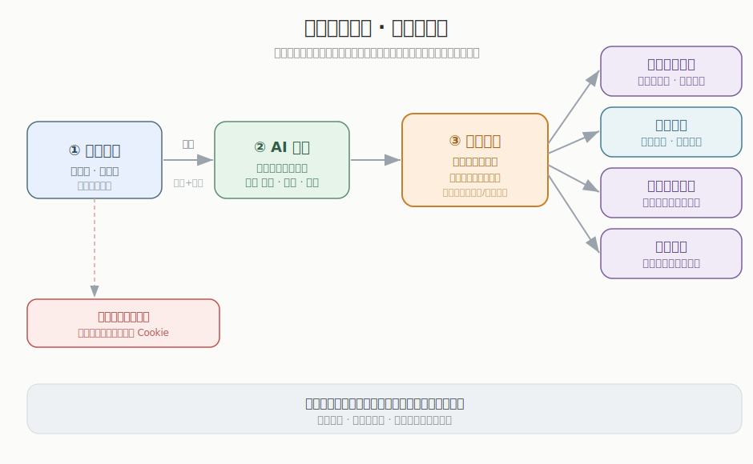
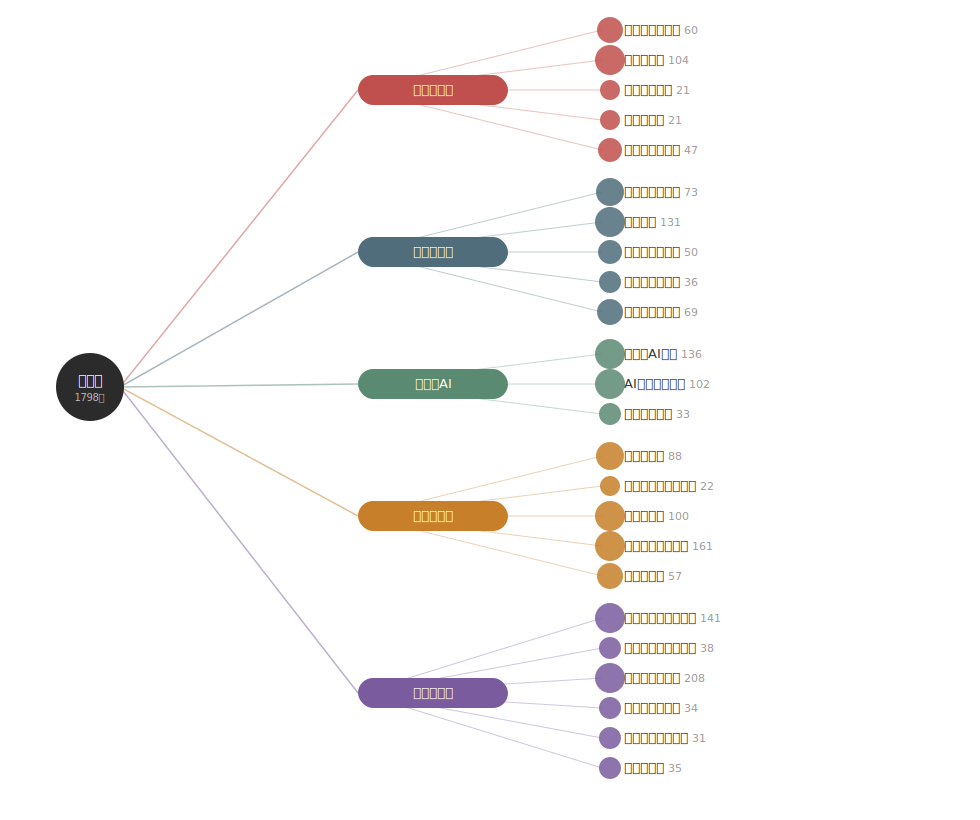

# 星球内容助手（知识星球每日抓取）

[English](README.md) | **简体中文**

每天自动抓取指定 [知识星球](https://zsxq.com) 群组的**星主发布**和**精华**内容，写入**飞书多维表格**；可选用大模型给每条内容生成一句话摘要 + 主题标签；把内容归类并生成**自动更新的知识图谱**和**每日待看队列**；每周日推送**精华周报**到飞书群；提供命令行**语义问答**。Cookie 失效时通过飞书机器人 Webhook 报警。

> 个人自用工具：把付费内容流沉淀成可检索、按专题组织的知识库。

## 效果展示

**各系统怎么串起来的**（大白话系统关系图）：



**知识图谱** —— 中心 → 5 大类 → 24 专题（每天自动重建；在网页里点某个专题，可看它的脉络综述和帖子，帖子按人物分组、标注已读/未读）：



> 飞书表格实拍图和操作演示 GIF 放在 [`assets/`](assets/) 目录。想自己补：用 `Win + Shift + S` 截图、用 [ScreenToGif](https://www.screentogif.com/) 录 GIF，存成 `assets/feishu.png` / `assets/demo.gif`，再在这里引用即可。

## 功能

- **每日抓取** —— 只抓 `scope=by_owner`（星主发布）和 `scope=digests`（精华），避免表格被普通成员灌水淹没。用本地状态文件去重。
- **可切换大模型加工** —— 每条帖子生成一句话摘要 + 主题标签 + 归一个专题。换模型只改 `.env`（DeepSeek / OpenAI / Claude / 任何 OpenAI 兼容接口），主流程不写死任何模型。
- **知识图谱** —— 独立、每日自动重建的 `HTML`：中心 → 5 大类 → 24 专题；点专题看大模型写的脉络综述和帖子（按人物分组、时间倒序、标注已读/未读）。
- **今日待看**（`今日待看.html`）—— 最新在前的待看清单 = 之前没看完的 + 最新抓到的。看完勾「看了」就移出队列；每条可写感想，附内置**知识卡片模板**。已看和感想存在浏览器里，每天自动重建也不丢。
- **每周精华周报** —— 每周日 20:00 汇总过去一周要点，推送到飞书群。
- **语义问答（轻量 RAG）** —— `python src/ask.py "姜胡说怎么看黄金"`，检索相关帖子并带引用综合回答。
- **Cookie 失效告警** —— 登录态失效时推送飞书机器人消息提醒。
- **稳健定时** —— Windows 任务计划双触发（开机登录 + 每天 9:00）、当天只成功一次、失败自动重试、关机期间自动补齐。

## 工作流程

```
知识星球 v2 API  ──抓取──▶  清洗/标准化  ──大模型加工──▶  飞书多维表格
  (星主 + 精华)              (去重)         摘要/标签/专题       │
                                                                ├─▶ 知识图谱 (HTML，每日自动重建)
                                                                ├─▶ 今日待看 (HTML，每日自动重建)
                                                                ├─▶ 精华周报 (飞书群，每周日)
                                                                └─▶ 语义问答 (命令行)
```

## 技术栈

Python 3 · `requests` · `python-dotenv` · `jieba` · `openai`（或 `anthropic`）。无 Web 框架，纯 API 调用。

## 快速开始

1. **克隆并安装**
   ```bash
   git clone https://github.com/Liz-Ji/Knowledge-Planet-daily-scraper.git
   cd Knowledge-Planet-daily-scraper
   python -m venv .venv
   .venv/Scripts/python.exe -m pip install -r requirements.txt
   ```
2. **配置** —— 复制 `.env.example` 为 `.env` 并填写：
   - `ZSXQ_COOKIE` —— 登录 `wx.zsxq.com` 后，F12 → 网络 → 任意 `api.zsxq.com` 请求 → 复制其中的 `zsxq_access_token`。
   - `ZSXQ_GROUPS` —— `群组ID:显示名称`，多个用逗号分隔。
   - `FEISHU_APP_ID` / `FEISHU_APP_SECRET` / `FEISHU_APP_TOKEN` / `FEISHU_TABLE_ID` —— 你的飞书应用 + 多维表格。
   - `FEISHU_ALERT_WEBHOOK` —— 飞书群机器人 Webhook。
   - `LLM_*` —— `LLM_API_KEY` 留空则跳过 AI 加工；国内建议 DeepSeek（直连不用代理，适合后台无人值守）。
3. **跑一次**
   ```bash
   .venv/Scripts/python.exe src/main.py
   ```
4. **注册定时任务**（Windows）
   ```powershell
   powershell -ExecutionPolicy Bypass -File scripts/setup_task.ps1
   ```

> 飞书多维表格需含约定字段（帖子ID、星球名称、类型、作者、标题、正文、发布时间、点赞数、评论数、原文链接、抓取时间、摘要、主题标签、专题）。字段定义见 [CLAUDE.md](CLAUDE.md)。

## 用法

| 命令 | 作用 |
|---|---|
| `python src/main.py [--force]` | 每日抓取 → 加工 → 写飞书 → 重建图谱 |
| `python src/build_graph.py [--refresh]` | 重建知识图谱 HTML（`--refresh` 全量刷新专题综述） |
| `python src/build_reading.py` | 重建「今日待看」HTML |
| `python src/weekly_report.py [--dry]` | 生成并推送周报（`--dry` 只打印） |
| `python src/ask.py "你的问题"` | 命令行语义问答 |
| `python src/backfill_enrich.py` | 给历史记录补摘要/标签（跑一次） |
| `python src/backfill_topics.py` | 给历史记录补专题分类（跑一次） |
| `python src/backfill_history.py` | 深翻补全整年历史（默认 2025，跑一次） |
| `python src/fix_links.py` | 批量重建"查看原文"链接为正确格式（幂等） |

## 目录结构

```
src/
  config.py          # 读取 .env
  zsxq_client.py     # 知识星球抓取（v2 接口、实体清洗、反爬重试）
  feishu_client.py   # 飞书多维表格读写
  notifier.py        # Webhook 报警
  summarizer.py      # 可切换大模型层：enrich() + chat()
  topics.py          # 24 个专题体系（知识图谱骨架）
  build_graph.py     # 生成/刷新知识图谱 HTML
  build_reading.py   # 生成/刷新「今日待看」HTML
  weekly_report.py   # 每周精华周报
  ask.py             # 语义问答命令行
  main.py            # 每日主入口
  backfill_*.py / fix_links.py  # 一次性维护脚本
scripts/
  run_daily.ps1 / run_weekly.ps1 / setup_task.ps1   # Windows 定时
```

## 附带：知识库驾驶舱（可选）

`src/panel.py` 是一个本地小面板（`http://localhost:8825`），把抓到的内容接进你自己的 Markdown 知识库（`KB_DIR`）：速记、**待看队列**（和 `今日待看.html` 同一份数据，但已看/感想状态存在服务端，清缓存也不丢）、拖文件、全库搜索，以及 Claude 驱动的「整理成卡片 / 写口播」。用 `python src/panel.py` 启动；需设置 `KB_DIR`，AI 按钮需要 `.env` 里的 `PANEL_LLM_*`。配套小工具：`capture.py`（速记）、`import_biji.py`（导入笔记）、`backup_kb.py`（给知识库做 git 备份）。

## 说明

- 使用知识星球**非官方**网页接口；若某天被加强反爬，请求头/版本号可能需要偶尔更新。踩坑与排查详见 [CLAUDE.md](CLAUDE.md)。
- 密钥只存在 `.env`（已被 git 忽略）。生成的 `知识图谱.html`、`今日待看.html`、日志、去重状态也都被 git 忽略。
- 面向本地 Windows 机器的个人自用场景设计。

## 许可

个人项目，未指定开源许可，请自行斟酌使用。
